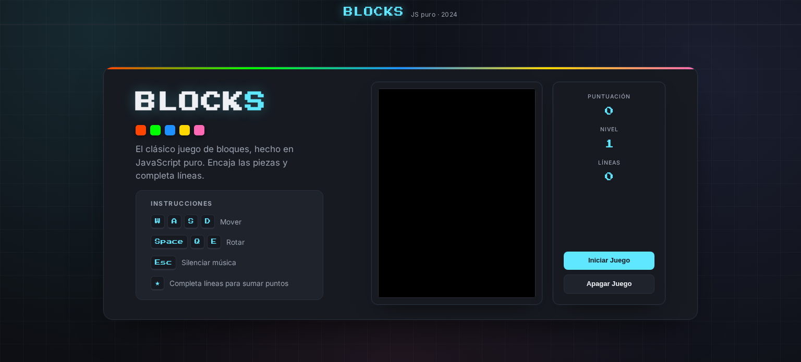

# Blocks Game

A small legacy browser game built with plain JavaScript, HTML Canvas, and CSS.

This project is a rescued portfolio piece: the original gameplay logic was kept intentionally close to its early version, while the presentation, folder structure, and visual polish were updated so it can stand as a clean showcase of older work.



## Gameplay Preview


## About

Blocks Game is a falling-block puzzle game inspired by classic block-stacking mechanics. Pieces spawn at the top of the board, move through a grid, rotate, settle, and can clear completed rows for points.

The project does not use a framework, bundler, or package manager. It is intentionally simple and runs directly in the browser.

## Features

- Canvas-based rendering.
- Keyboard-controlled block movement and rotation.
- Row detection and score updates.
- Lightweight arcade-style interface.
- No build step or external runtime required.

## Controls

| Key | Action |
| --- | --- |
| `W` `A` `S` `D` | Move the active piece |
| `Space` | Rotate |
| `Q` / `E` | Rotate left / right |
| `Esc` | Toggle music |

## Running Locally

Open `index.html` directly in your browser.

For a local HTTP server, from this folder you can run:

```bash
python3 -m http.server 8080
```

Then open:

```text
http://localhost:8080
```

## Project Structure

```text
.
|-- index.html
|-- src
|   |-- css
|   |   `-- style.css
|   `-- js
|       |-- blocks-data.js
|       |-- data.js
|       |-- graphics.js
|       |-- logics.js
|       `-- script.js
|-- assets
|   |-- audio
|   |   `-- sound.mp3
|   `-- icons
|       `-- logo.ico
|-- docs
|   `-- screenshots
`-- LICENSE
```

## Technical Notes

The block definitions live in `src/js/blocks-data.js` as a JavaScript object instead of an external JSON file. This keeps the game usable when opened through `file://`, where browser restrictions can block `fetch()` requests to local JSON files.

The code is intentionally not rewritten into a modern architecture. The goal of this version is to preserve the original JavaScript logic while making the project easier to view, run, and understand.

## License

MIT License. See [LICENSE](LICENSE).
